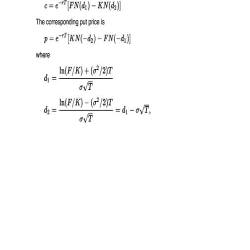

<!-- Limit image width and height -->

<!-- Center image on slide -->

## What is a Swaption?

A **Swaption** is an option to enter into a swap at a future time. 

+ The underlying swap can be a receive fixed swap ("receiver" swaption) or pay fixed swap ("payers" swaption). A receiver protects against rates declining while a payer protects against rates increasing

+ The option can be exercised according to predefined rules. A European Swaption can be exercised once on a specific date while an American can be exercised at any time. These features are **boundary conditions** for the option. The most common swaption is a European exercise. 

--- .class #id 

## Original European Valuation

### Using Black Futures Model
1. Enter strike as yield strike of swaption
2. Future price is implied forward rate for underlying swap
3. Enter yield vol and discount rate to option expiration
4. For payer swaption, take call value, and for receivers, put value
5. Multiply the result by BPV of underlying swap

--- .class #id 

## Strike Level

1. Skew is evident in graph of market prices
2. To deal with this market uses a SABR model with more parameters to "fit" the vols

---
## Strike Level
#### We move from 1-d rate diffusion to 2-d random process where additonally volatility is stochastic

#### For each tenor at a given expiration we fit 
1. **alpha**    – vol of vol
2. **beta**     – order of coefficient in diffusion term 
3. **rho**      - correlation of vol and underlying rate

